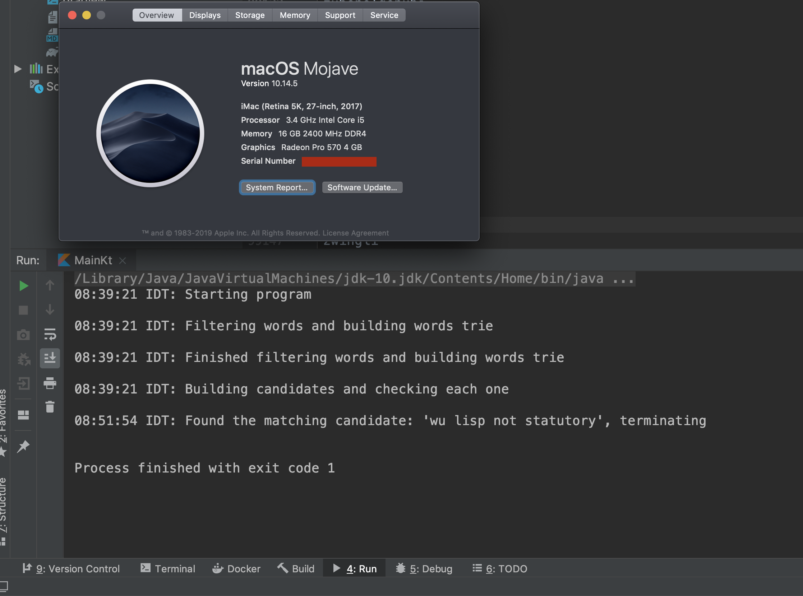

<h1 align="center">
   My Solution  :flashlight:
</h1>

<h4 align="center">My proposed solution to the "follow the rabbit hole" backend challenge</a>.</h4>

  <a href="#my-strategy">My Strategy</a> •  
  <a href="#identifying-challenges">Identifying Challenges</a> •  
  <a href="#summary">Summary</a> •  

## My strategy 

* Filtering of the full words list, to create a lighter version of the dictionary.
  - Keep only words that don't go over the limit of any letter
  - Remove words that are longer than the length of the "clue"
  - Remove words that have letters that don't appear in the "clue"
* Building a prefix tree
  - Adding every word from the previous step to a prefix tree structure
  - A compact way to store huge amount of words, and it will make it easier to assemble candidates later on.
* Create Candidate
  - Go over the prefix tree, and create candidates phrases (we need to check again that they are valid)
  - For each candidate, run the md5 hash, and if we have a match, stop the process and output the relevant word.

## Identifying Challenges 
Prior to my coding, I had tried coming up with the various
challenges I should be taking into account.  
At first, I did'nt understand how come there are 3 different levels of the challenge. 
The problem was, I assumed we are talking about 2 spaces only.  
And that's when I proved to be wrong, because my solution could not find the third phrase.  
I had to change my solution to support 3 spaces as well, (or any number, for that matter). 
After researching patterns to store strings, I was pretty sure that the way to go is a prefix trie.  
 
These are the important challenges I had identified:
 - the solution should work for any number of "required spaces" (any number of words in the anagram)
 - make the dictionary lighter
 - build the candidate in a relatively easy way.

## Summary 
It was a very interesting challenge, I must say. 
Taking what we learn in theory, into heavyweight practice. 
Like I had mentioned here, my first attempt was intended for 3 words in the anagram,
which was a mistake. 
Later on, I changed it to support any number of words.
 
I added here the stats for the hard challenge. it took about 11 mins to solve on my machine.

